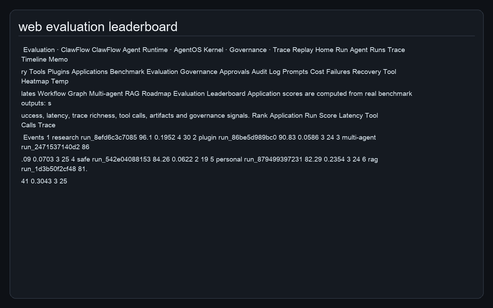
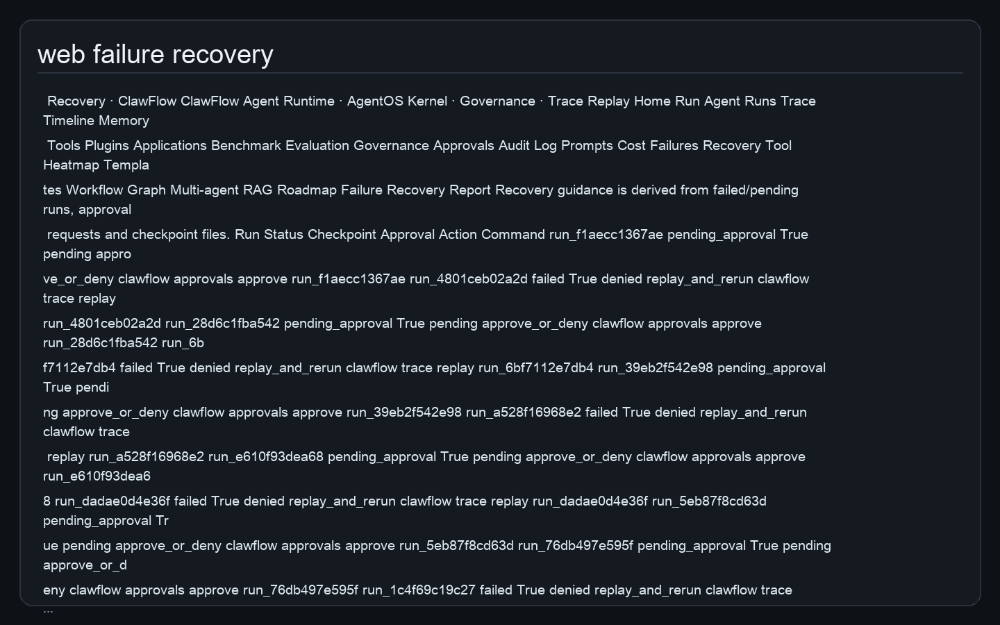
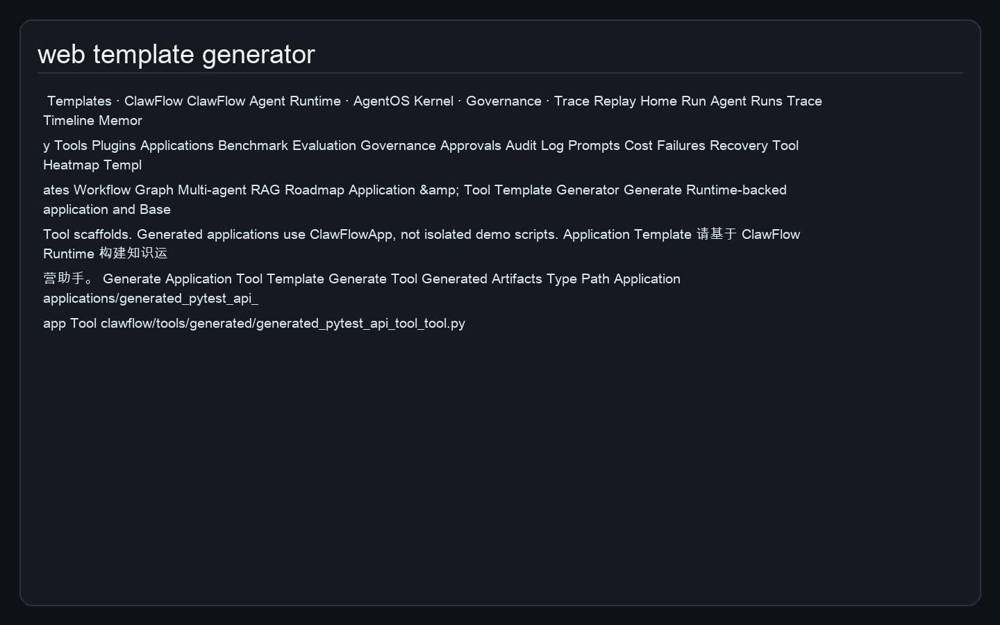
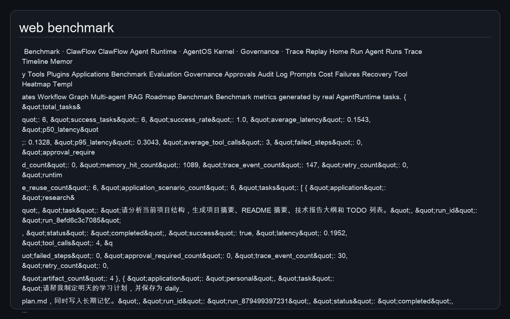
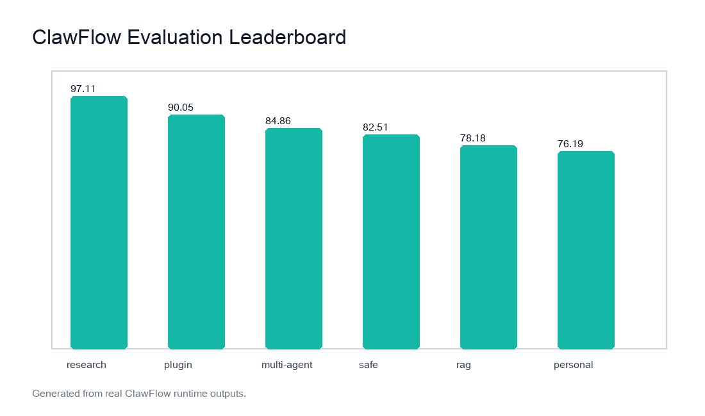
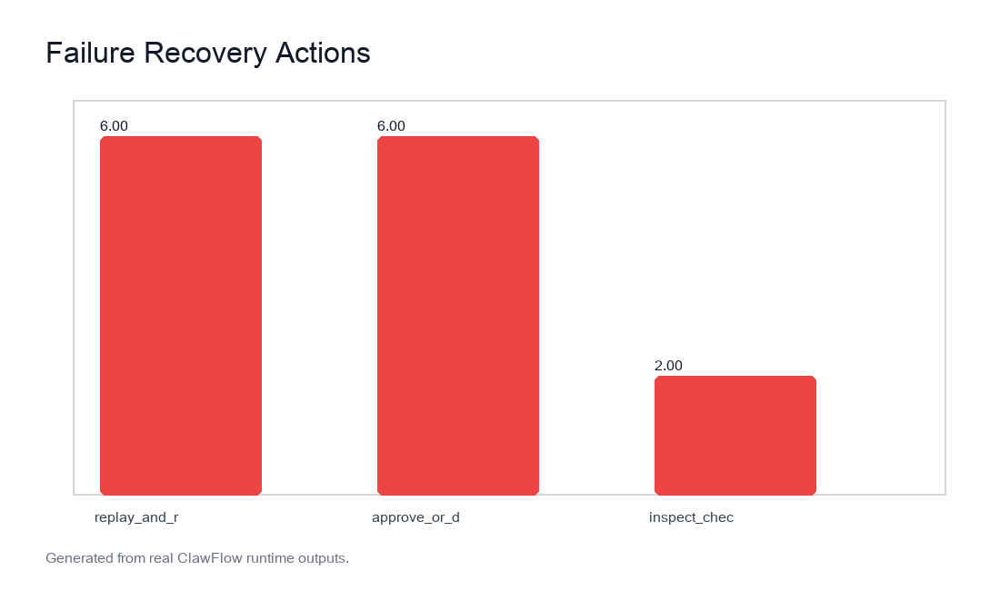

# ClawFlow

**A Lightweight Agent Runtime for Next-Generation Personal AI Agents**

> 让智能体从能回答走向能执行、能记忆、能恢复、能协作、能治理。

ClawFlow is a lightweight **Agent Runtime / AgentOS Kernel** prototype for building next-generation personal AI agents. It is not a ChatGPT API wrapper and not a folder of isolated demo scripts. It provides a reusable infrastructure layer for **Workflow Orchestration**, **Checkpoint & Resume**, **Tool Sandbox**, **Permission Governance**, **Memory Layer**, **Observability**, **Trace Replay**, **Plugin Registry**, **MCP-like Connector**, **RAG Module**, **Event Bus**, **Scheduler**, **Benchmark & Evaluation**, and **Multi-agent Collaboration**.


## Why ClawFlow is not just demos

- Example Applications are validation workloads for the framework, not the project body.
- Every application goes through the same `AgentRuntime`, Planner, Executor, Tool Registry, Memory Layer, Trace Store, Checkpoint Store and Permission Governance path.
- Developers can use these applications as templates to build their own agent applications.
- ClawFlow's core is **Agent Runtime / AgentOS Infrastructure**.
- The implementation uses real state, real SQLite persistence, real JSONL trace, real checkpoint files, real output artifacts and a Web UI that reads persisted data.
- Local adapters are implemented for email, calendar, search and model planning, with clear extension boundaries for real services.

## Core Features

| Capability | Implementation |
|---|---|
| Agent Runtime | `AgentRuntime` coordinates planning, execution, memory, trace, checkpoint and governance |
| AgentOS Kernel | Runtime facade, state manager, event bus, scheduler, policy engine |
| Planner | Deterministic local planner + OpenAI-compatible JSON planner fallback |
| Executor | Step validation, tool calls, permission checks, retry boundary, checkpoint and reflection summary |
| Workflow Orchestration | Step Graph, dependencies, status transitions, JSON export |
| Checkpoint & Resume | File-backed checkpoints under `outputs/checkpoints/` |
| Tool Sandbox | Registered `BaseTool` classes with risk levels and schemas |
| Permission Governance | allow / ask / deny policy, human-in-the-loop boundary, audit log |
| Human Approval Queue | Web/API/CLI approval and denial backed by SQLite approval requests |
| Memory Layer | SQLite memory store with keyword search and hit counts |
| Observability | SQLite run table, trace events, JSONL export, replay |
| Prompt Template Registry | SQLite templates for repeatable developer-facing workflows |
| Cost & Failure Dashboard | Run metrics, estimated tokens, pending approvals, error traces |
| Tool Usage Heatmap | Real `tool_call` trace aggregation for observability |
| Evaluation Leaderboard | Scores applications from real benchmark rows |
| Failure Recovery Report | Recommends resume/replay/approval actions from checkpoints and failed runs |
| Plugin Registry | Manifest-driven plugin tools loaded into Tool Registry |
| MCP-like Connector | Local email, calendar, search connectors with replaceable interface |
| RAG Module | Document loader, chunker, keyword retriever, grounded answer |
| Multi-agent Collaboration | ManagerAgent, ResearchAgent, ToolAgent, CriticAgent, MemoryAgent, ReportAgent, SlideAgent, GovernanceAgent |
| Benchmark & Evaluation | Real Runtime tasks, latency, success rate, tool calls and trace events |
| Developer Templates | `clawflow generate app ...` and `clawflow generate tool ...` produce Runtime-backed scaffolds |

## Architecture

ClawFlow uses a layered AgentOS-style architecture:

- **Gateway**: CLI, FastAPI and Web Dashboard.
- **AgentOS Kernel**: `AgentRuntime`, Planner, Executor, State, Event Bus, Scheduler and Policy Engine.
- **Infrastructure Layer**: Tool Registry, Tool Sandbox, Memory Layer, Trace Store, Checkpoint Store, Audit Log, Approval Queue, Prompt Template Registry, Plugin Registry and RAG.
- **Local Replaceable Adapters**: SQLite, JSONL, Markdown artifacts, local outbox, local calendar, local document search and deterministic local planning.
- **Example Applications**: Research, Personal, Safe Tool Call, Multi-agent, RAG, Plugin, Trace Replay, Human Approval, Benchmark and Web Dashboard.


## Quick Start

```bash
make install
clawflow app research
clawflow app personal
clawflow app safe
clawflow app multi-agent
clawflow app rag
clawflow benchmark
clawflow serve
```

Open `http://127.0.0.1:8000/dashboard` for the Web Dashboard.

## Installation

```bash
python -m pip install -e .
```

Optional external LLM mode is configured through `.env` or shell variables. The default local mode requires no API key and still produces dynamic plans from task intent, files, tools and memory.

## CLI

```bash
clawflow run "帮我整理这个项目" --yes
clawflow trace list
clawflow trace replay <run_id>
clawflow memory list
clawflow tools list
clawflow resume <run_id> --yes
clawflow approvals list --status pending
clawflow approvals approve <run_id>
clawflow prompts list
clawflow metrics cost
clawflow metrics tools
clawflow metrics failures
clawflow policy set high ask --reason "Keep destructive tools approval-gated"
clawflow generate app knowledge_ops --task "请基于 ClawFlow Runtime 构建知识运营助手。"
clawflow generate tool local_crm_lookup --risk medium
```

## API

```bash
curl http://127.0.0.1:8000/health
curl -X POST http://127.0.0.1:8000/run \
  -H 'Content-Type: application/json' \
  -d '{"task":"请分析当前项目结构","auto_approve":true}'
curl http://127.0.0.1:8000/evaluation
curl http://127.0.0.1:8000/failure-recovery
curl http://127.0.0.1:8000/metrics/tool-usage
curl -X POST http://127.0.0.1:8000/templates/app \
  -H 'Content-Type: application/json' \
  -d '{"name":"generated_ops_agent","task":"请基于 Runtime 生成运营助手。"}'
```

## Web UI

The Web Dashboard reads real persisted state instead of static page data:

- `/dashboard`: AgentOS infrastructure overview.
- `/run-agent`: trigger `AgentRuntime`.
- `/runs-page`: persisted run list.
- `/trace-timeline`: replayable trace timeline.
- `/memory-browser`: long-term memory browser.
- `/tools-page`: Tool Sandbox registry.
- `/plugins-page`: plugin manifest and dynamic tools.
- `/applications-page`: Runtime-backed application gallery.
- `/benchmark-page`: real benchmark results and figures.
- `/evaluation-leaderboard`: application evaluation leaderboard.
- `/governance-page`: editable policy governance.
- `/approvals-page`: approve/deny pending high-risk runs.
- `/prompts-page`: Prompt Template Registry.
- `/cost-page`: estimated token/cost dashboard.
- `/failure-analysis`: failed and pending run analysis.
- `/failure-recovery`: checkpoint-backed recovery recommendations.
- `/tool-usage`: tool usage heatmap from trace events.
- `/template-generator`: application/tool scaffold generator.

## Example Applications

| Application | Output | Infrastructure validated |
|---|---|---|
| Research Assistant | `outputs/research_summary.md`, `outputs/report_outline.md`, `outputs/TODO.md` | Planner, file tools, report tools, trace, memory |
| Personal Assistant | `outputs/daily_plan.md` | Memory Layer, checkpoint, trace |
| Safe Tool Call | `outputs/delete_dry_run.md` | Permission Governance, dry-run, audit log |
| Multi-agent Project Analysis | `outputs/multi_agent_report.md` | Multi-agent Collaboration, Tool Registry |
| RAG Assistant | `outputs/rag_answer.md` | RAG pipeline, retrieval trace, memory |
| Plugin Tool Application | `outputs/plugin_workspace_stats.json` | Plugin Registry and dynamic tool loading |
| Trace Replay | `outputs/trace_*.json` | Trace Replay and run lifecycle |
| Human Approval | pending checkpoint | Human-in-the-loop approval boundary |
| Benchmark Application | `outputs/benchmark_results.json` | Benchmark & Evaluation |
| Web Dashboard | persisted UI pages | Multi-channel Gateway |

Each application is deliberately implemented as a downstream user of the framework. The application code calls `AgentRuntime`, the runtime calls the Planner and Executor, the Executor calls Tool Registry, and every step is governed, traced, checkpointed and reflected in Web UI state.

## Screenshots








Screenshot generation prefers Playwright live-browser capture when available. If the environment has no browser runtime, `scripts/generate_screenshots.py` writes renderable HTML snapshots and deterministic image panels, with the method recorded in `docs/assets/screenshots/screenshot_method.txt`.

## Benchmark

Latest benchmark summary:

- Total tasks: 6
- Success rate: 1.0
- Average latency: 0.1543
- Average tool calls: 3
- Trace events: 147





## Evaluation & Recovery

`scripts/run_benchmark.py` now generates:

- `outputs/benchmark_results.json`
- `outputs/benchmark_results.md`
- `outputs/evaluation_leaderboard.json`
- `outputs/evaluation_leaderboard.md`
- `outputs/failure_recovery_report.json`
- `outputs/failure_recovery_report.md`

The leaderboard scores real applications using success, latency, trace richness, tool calls, artifact count and governance signals. The recovery report reads failed/pending runs, approval requests and checkpoint files, then recommends actions such as approval, trace replay or checkpoint inspection.

## Developer Framework

ClawFlow includes a lightweight SDK and template generators:

```python
from clawflow.sdk import ClawFlowApp

APP = ClawFlowApp(
    name="my_agent_app",
    task="请基于 ClawFlow Runtime 执行一个可观测任务。",
    auto_approve=True,
)

result = APP.run()
```

CLI and Web templates produce Runtime-backed applications and `BaseTool` scaffolds. Generated applications are not standalone demos; they use the same Runtime, governance, memory, trace and checkpoint chain.

## Project Structure

```text
clawflow/                 Agent Runtime, tools, memory, workflow, governance, observability, gateways
applications/             Runtime-backed Example Applications
docs/                     Architecture docs, technical report, screenshots, diagrams and figures
slides/                   PPT outline, notes, PPTX and PDF
scripts/                  Benchmark, screenshots, diagrams, report, PPT and template generation
tests/                    Pytest coverage for runtime, tools, policy, memory, API, RAG, plugins and UI
outputs/                  SQLite, JSONL trace, checkpoints, generated reports and benchmark artifacts
.github/                  Issue and PR templates
```

## Deployment

```bash
docker compose up --build
```

or:

```bash
make serve
```

The Docker setup mounts `outputs/` and `docs/assets/` so runtime state, benchmark artifacts and screenshots remain visible outside the container.

## Configuration

`config.yaml` controls LLM mode, storage path, policy mapping, shell allowlist, web server and benchmark tasks. `.env.example` documents OpenAI-compatible provider settings:

```bash
OPENAI_API_KEY=
OPENAI_BASE_URL=https://api.openai.com/v1
OPENAI_MODEL=gpt-4o-mini
CLAWFLOW_LLM_MODE=local
```

## Security

Shell commands are whitelist-only. Destructive delete is implemented as `delete_file_dry_run`; it writes a report and does not remove files. Medium/high-risk operations are policy-gated and recorded in Audit Log.

## Roadmap

- MCP-compatible connector packaging.
- Production vector store backends such as Chroma, FAISS and Milvus.
- Real SMTP, Calendar, CRM and browser automation connectors.
- Distributed task queue and cloud trace backend.
- Plugin marketplace signing and compatibility checks.
- Multi-model routing and provider-level cost accounting.

## License

Apache-2.0. It is suitable for infrastructure projects, supports academic and commercial reuse, includes patent grant protection, and encourages open-source ecosystem growth.
