# ClawFlow 技术报告书

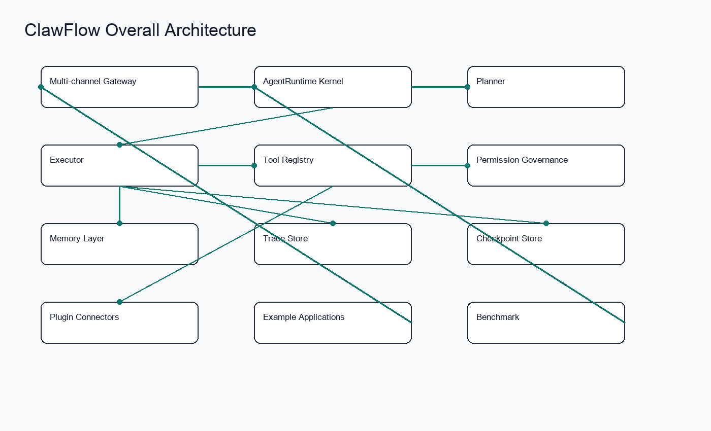

## 摘要

ClawFlow: A Lightweight Agent Runtime for Next-Generation Personal AI Agents 是一个面向下一代个人智能体的轻量级 Agent Runtime / AgentOS 基础设施原型。本项目的核心目标不是制作一个简单的 ChatGPT API 套壳，也不是堆砌若干孤立 demo.py，而是把智能体应用中反复出现的规划、执行、工具调用、权限治理、记忆管理、断点恢复、可观测追踪、多通道接入、插件扩展、RAG 检索、多智能体协作和评测复现抽象成统一运行时。

项目宣传语是“让智能体从能回答走向能执行、能记忆、能恢复、能协作、能治理”。在实现上，ClawFlow 提供 AgentOS Kernel、Workflow Orchestration、Checkpoint & Resume、Tool Sandbox、Permission Governance、Memory Layer、Observability、Trace Replay、Plugin Registry、MCP-like Connector、RAG Module、Event Bus、Scheduler、Benchmark & Evaluation 与 Multi-agent Collaboration。系统在无外部 LLM Key、无真实邮箱账号、无真实日历权限、无外部搜索 API 的条件下，仍然通过 DeterministicLocalProvider、本地 outbox、本地 calendar store、本地文档检索和 SQLite 持久化保证真实数据流可运行。

## 项目背景与意义

传统智能体项目常停留在 Prompt + Tool Calling 的一次性演示阶段。它们能展示模型回答或调用一个工具，但通常缺少长期任务生命周期、状态持久化、权限策略、失败恢复、执行过程可观测、多应用复用接口以及开源社区规范。随着个人智能体从对话工具走向工作流执行器，Agent 应用需要的已经不是单个聊天页面，而是一个可编排、可治理、可追踪、可恢复的运行时系统。

ClawFlow 的意义在于将智能体执行过程从黑盒响应转化为状态迁移图。每个任务先被 Planner 生成结构化 Plan，再由 Executor 按 Step Graph 调用 Tool Registry，每一步都经过 Policy Engine，结果写入 Checkpoint Store、Trace Store、Memory Store 和 Audit Log。这样，开发者可以从一次性 Prompt Demo 迁移到可复用基础设施框架，在课程挑战赛和开源展示中体现底层技术创新价值。

## 国内外相关工作

OpenClaw / 小龙虾式个人智能体强调个人 AI 助理从信息回答走向任务执行，其方向启发了本项目对“个人 AgentOS”的定位。LangGraph 提供图式状态机和工作流编排，适合复杂 Agent DAG；AutoGen 聚焦多智能体对话和协作；OpenAI Agents SDK 强调工具调用、handoff 和 guardrails；AgentScope 提供多智能体应用开发框架。这些系统对智能体工程化具有重要参考价值。

ClawFlow 的差异化定位是轻量级、本地可运行、面向教学/科研/挑战赛验证的 Agent Runtime / AgentOS Kernel 原型。它不是试图替代大型框架，而是把 Runtime、Gateway、Memory、Trace、Governance、Plugin、RAG、Benchmark 和 Example Applications 组合成一个可以运行、可以截图、可以写报告、可以二次开发的基础设施雏形。相较普通 demo.py，ClawFlow 更关注统一运行时边界、真实持久化数据、权限审计、checkpoint/resume 和可复现实验。

## 问题定义与需求分析

本项目要解决的问题是：如何在没有外部服务强依赖的情况下构建一个真实可运行的 Agent Runtime，使下游应用可以复用统一的 Planner、Executor、Tool Registry、Memory、Trace、Checkpoint 和 Governance。需求包括：本地规划必须根据任务、文件、工具和记忆动态生成计划；工具必须通过统一注册表调用；权限必须根据风险等级治理；执行过程必须可观测；失败或审批中断必须能 checkpoint/resume；示例应用必须通过统一 Runtime 触发；Web UI 必须读取真实持久化数据；Benchmark 结果必须来自真实运行。

## 总体架构设计

ClawFlow 采用分层架构。最上层是 Multi-channel Gateway，包括 CLI、FastAPI 和 Web UI。中间层是 AgentOS Kernel，包含 AgentRuntime、Planner、Executor、State Manager、Event Bus、Scheduler、Policy Engine 和 Workflow Engine。能力层包括 Tool Sandbox、Memory Layer、Trace Store、Checkpoint Store、Audit Log、Plugin Registry、RAG Module 与 Connectors。最下层是本地可替换适配器，包括 SQLite、JSONL、Markdown 输出、本地 outbox、本地 calendar、本地文档检索和 DeterministicLocalProvider。Example Applications 位于框架外侧，只通过 Runtime 调用基础设施。

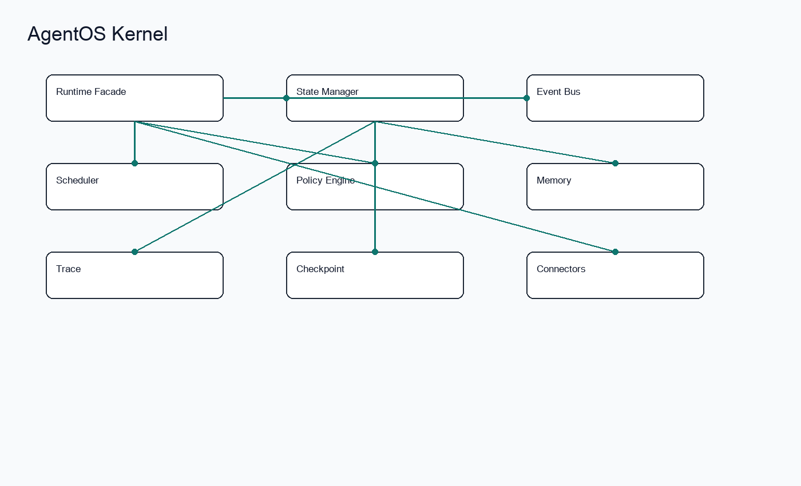

## AgentOS Kernel 设计

AgentOS Kernel 是 ClawFlow 的核心抽象。它不负责具体业务，而负责管理智能体任务生命周期：接收任务、规划、执行、权限判断、状态保存、记忆更新、trace 记录、checkpoint、resume 和 replay。Kernel 的价值在于把一次性模型响应提升为可治理的运行时协议。当前实现为轻量级本地版本，但 Runtime、Provider、Connector、VectorStore、Tool 和 Policy 均有替换接口，后续可接入生产级后端。

## Agent Runtime 设计

`AgentRuntime` 是外部调用入口。CLI、API、Web 和 applications 目录中的应用都调用 `AgentRuntime().run(...)`，因此不会绕过核心链路。Runtime 初始化 Settings、MemoryStore、TraceStore、AuditLog、CheckpointStore、ToolRegistry、ToolPolicy、Planner 和 Executor。运行时会生成 run_id，写入 run_started，调用 Planner 生成 Plan，记录 plan_created，然后进入 Executor。执行完成后记录 final_answer、metrics 和 memory_update。

## Workflow Orchestration 与 Checkpoint 设计

Workflow Engine 使用 Step Graph 表示计划。每个 PlanStep 包含 id、action、args、depends_on、retry 和 description。当前版本支持 DAG 风格依赖检查和顺序执行，记录 pending、running、completed、failed、skipped、pending_approval 等状态。每一步执行后，CheckpointStore 将 run_id、user_input、plan、graph、completed_steps、artifacts 和 step_results 写入 `outputs/checkpoints/<run_id>.json`。Resume 时从 checkpoint 恢复已完成步骤并继续执行未完成步骤。

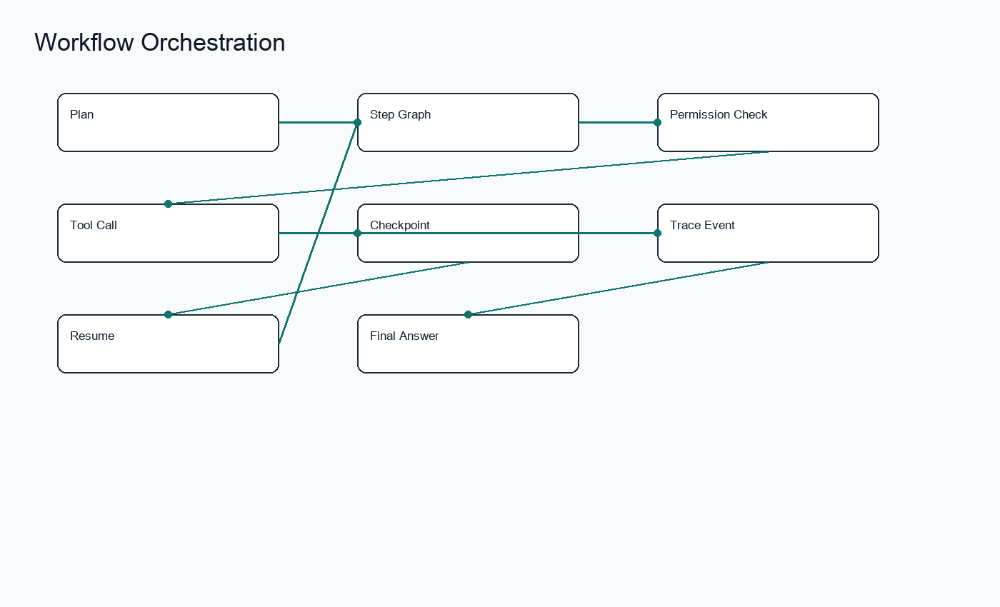

## Tool Sandbox 与 Permission Governance 设计

所有工具继承 BaseTool，必须声明 name、description、risk_level、input_schema、output_schema 和 run(args, context)。ToolRegistry 支持注册、查询、启用/禁用、执行和元数据导出。Shell 工具采用白名单，禁止 rm、del、format、shutdown、sudo、chmod、powershell、curl、wget 等高危命令。delete_file 被实现为 `delete_file_dry_run`，只生成候选文件报告，不删除任何文件。

Permission Governance 使用 `ToolPolicy` 将 low、medium、high 映射到 allow、ask、deny。每次决策都会写入 Trace 和 Audit Log。非交互模式遇到 ask 且未自动批准时会进入 pending_approval，展示 Human-in-the-loop 边界。

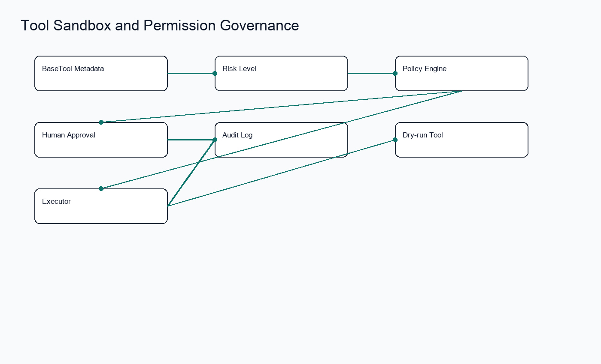
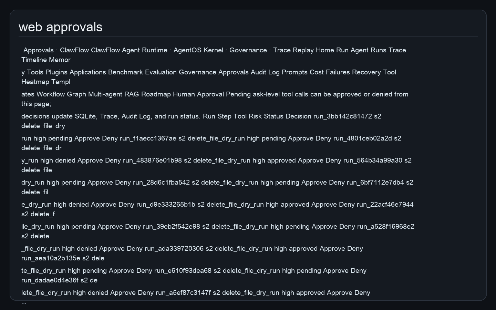

## Memory Layer 设计

Memory Layer 使用 SQLite 持久化，实现 add_memory、search_memory、list_memory、delete_memory 和 hit_count。search_memory 采用关键词打分，命中后增加 hit_count。VectorStoreBase 定义了向量存储接口，SimpleKeywordVectorStore 提供本地占位实现，后续可替换 Chroma、FAISS 或 Milvus。Personal Assistant、RAG Assistant、多智能体分析和 Runtime 完成摘要都会写入长期记忆。

## Observability 与 Trace Replay 设计

Observability 是 ClawFlow 区别普通 Agent Demo 的关键模块。TraceStore 同时写入 SQLite 和 JSONL，记录 run_started、plan_created、workflow_graph_created、step_start、permission_decision、tool_call、tool_result、checkpoint_saved、retrieval、memory_update、error、reflection_summary 和 final_answer。CLI 支持 trace list/show/export/replay，Web UI 提供 Trace Timeline 页面。

新增 Cost Dashboard、Tool Usage Heatmap 和 Failure Analysis 将 run metrics、estimated tokens、estimated cost、tool_call 聚合、pending approvals、error trace 和 failed runs 统一展示，体现 AgentOS 不只是执行任务，也需要运行时运营能力。

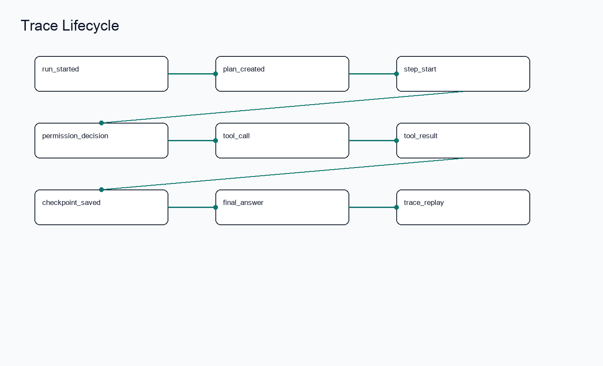
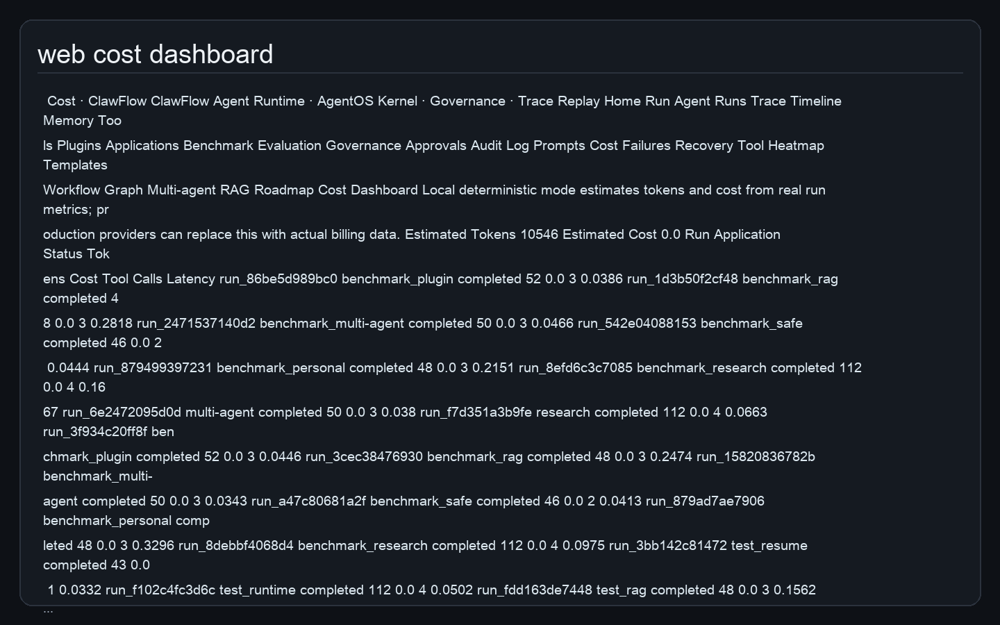
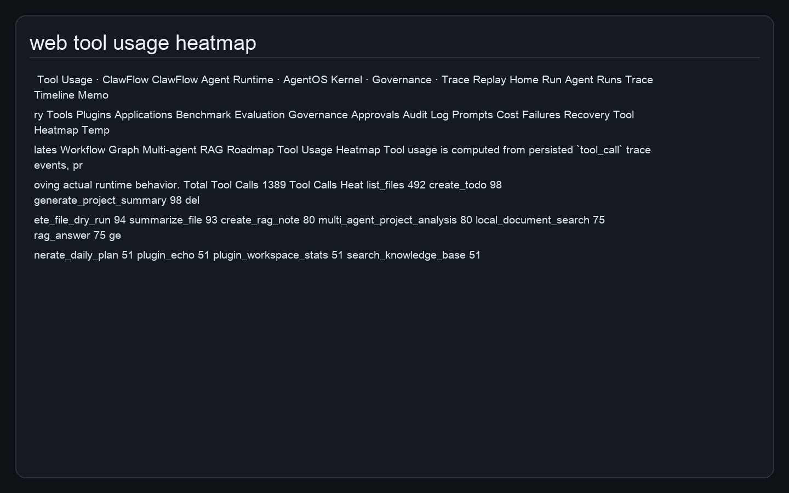
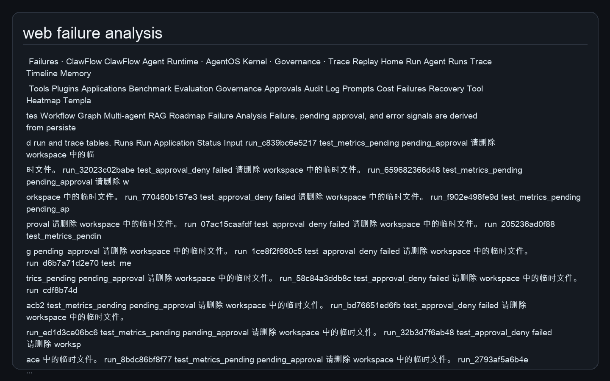

## Multi-channel Gateway 设计

ClawFlow 提供 CLI、FastAPI 和 Web UI 三类入口。CLI 面向开发者和答辩演示，支持 run、serve、trace、memory、resume、tools、app、benchmark。FastAPI 提供 /health、/run、/runs、/runs/{run_id}/trace、/runs/{run_id}/resume、/tools、/memory、/plugins、/benchmark、/audit、/governance、/workflow、/applications。Web UI 读取真实 SQLite、JSON 和输出文件，包含首页、Run Agent、Runs、Trace Timeline、Memory、Tools、Plugins、Applications、Benchmark、Governance、Audit Log、Workflow Graph、Multi-agent、RAG、Roadmap。

## 插件扩展机制

插件系统由 plugin_manifest.json、PluginLoader 和 DynamicPluginTool 组成。当前实现包含 plugin_workspace_stats 和 plugin_echo，前者读取真实工作区文件数量并写入 outputs/plugin_workspace_stats.json，后者展示动态工具调用。插件工具会真实进入 Tool Registry，因此 CLI、Runtime 和 Web UI 都可以看到它们。该机制为 MCP、企业 API、第三方 SaaS 工具和自定义工具接入预留标准化接口。

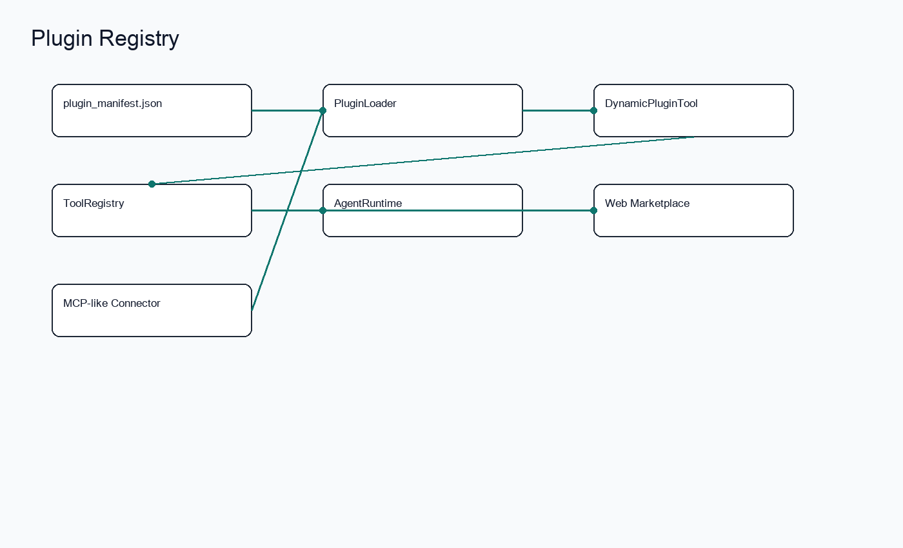

## Prompt Template Registry 设计

Prompt Template Registry 使用 SQLite 持久化 prompt_templates 表，保存 name、description、template、tags、usage_count 和更新时间。CLI、API 与 Web UI 均可列出、渲染或新增模板。该模块把提示词从散落在应用代码中的字符串提升为可复用、可审计、可统计使用次数的运行时资源，进一步强化 Developer-facing Framework 定位。

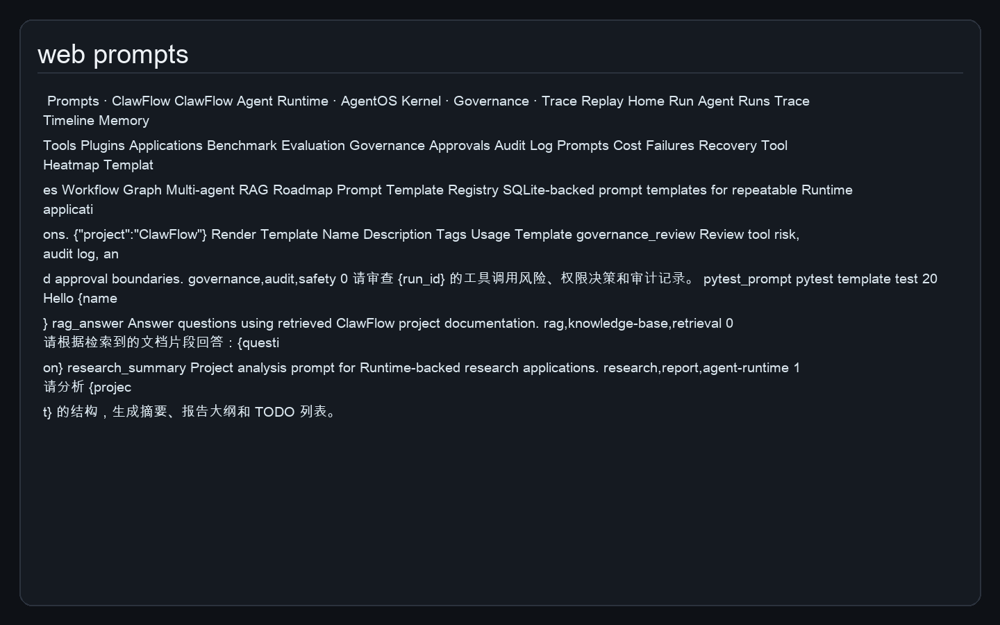

## RAG 模块设计

RAG Module 包含 DocumentLoader、Chunker、KeywordRetriever 和 RagEngine。DocumentLoader 从 docs、README.md、outputs 等真实文件加载文档；Chunker 切分片段；KeywordRetriever 根据查询词打分；RagEngine 生成带路径引用的 Markdown 答案。RAG Example Application 必须通过 Runtime 触发，trace 中记录 retrieval 事件，输出写入 outputs/rag_answer.md。

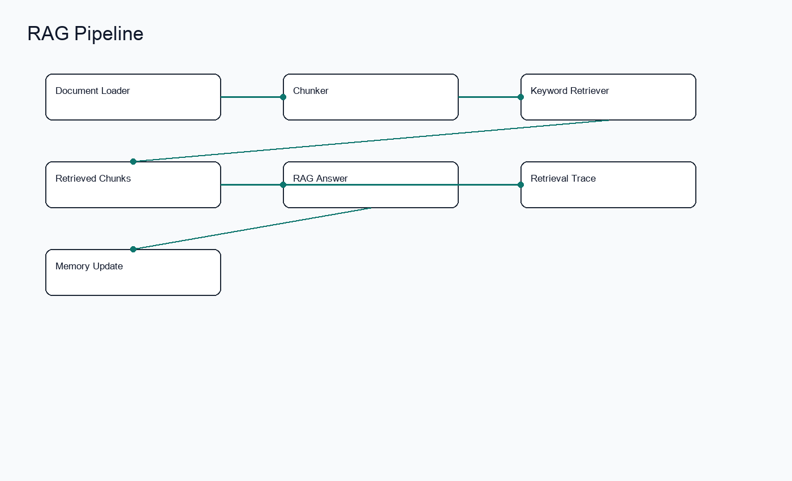

## 多智能体协作机制

Multi-agent Collaboration 由 ManagerAgent、ResearchAgent、ToolAgent、CriticAgent、MemoryAgent、ReportAgent、SlideAgent 和 GovernanceAgent 组成。当前实现为本地可运行协作流，通过 multi_agent_project_analysis 工具进入统一 Runtime。ToolAgent 使用 Tool Registry 调用 list_files，MemoryAgent 写入 MemoryStore，ReportAgent 输出 outputs/multi_agent_report.md。该设计展示多智能体协作可以作为 Runtime 工具和工作流能力，而不是脱离框架的脚本。

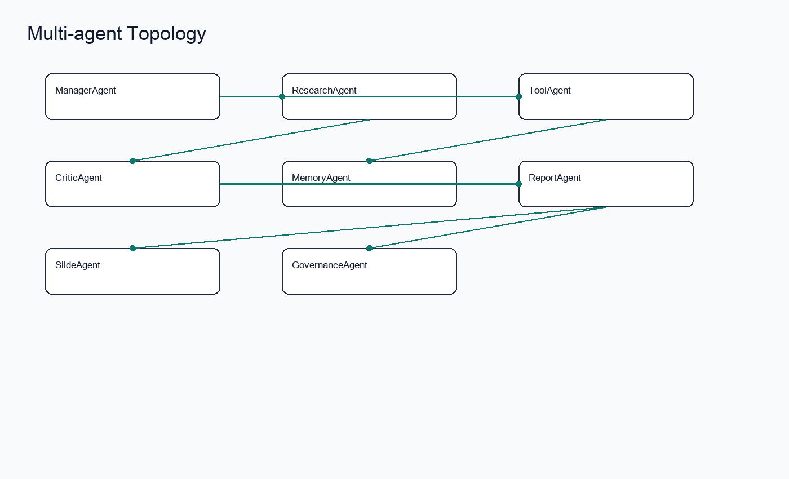

## Event Bus 与 Scheduler 设计

Event Bus 提供 publish/subscribe 轻量事件机制，用于后续扩展异步观察者、通知和 UI 实时更新。Scheduler 使用 SQLite 保存本地计划任务，当前用于展示 AgentOS Kernel 中 Background Task Queue 的接口形态。虽然当前为轻量级本地实现，但已定义可替换边界，未来可接入 Celery、RQ、Kafka、Redis Streams 或云队列。

## Example Application 设计与真实可落地验证

Example Applications 不是项目主体，而是验证基础设施能力的落地样例。Research Assistant 证明项目分析、报告生成和 TODO 输出可以复用 Runtime；Personal Assistant 证明 Memory Layer 真实写入；Safe Tool Call 证明 Permission Governance 和 dry-run；Multi-agent Project Analysis 证明角色协作和 Tool Registry；RAG Assistant 证明本地文档检索和 grounded answer；Plugin Tool Application 证明插件注册与执行。

            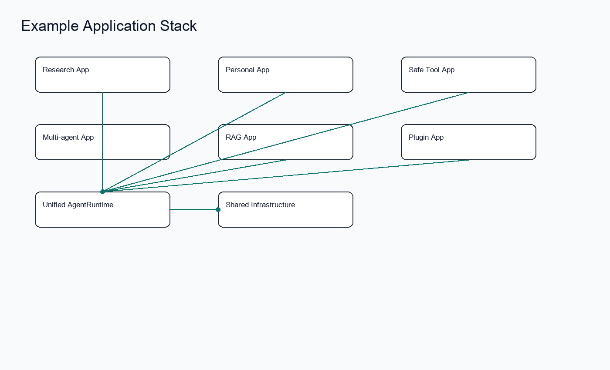

            # Application Run Summary

- research_assistant: `run_8aa7fd0213b5` status=completed artifacts=4
- personal_assistant: `run_db09c564c7c6` status=completed artifacts=1
- safe_tool_call: `run_360a04480715` status=completed artifacts=1
- multi_agent_project_analysis: `run_7909d8605e3f` status=completed artifacts=1
- rag_assistant: `run_c425b2ddc6cb` status=completed artifacts=1
- plugin_tool_app: `run_0d9ada8c59c5` status=completed artifacts=1
- human_approval: `run_1824dfceece3` status=pending_approval artifacts=0

## 性能优化与扩展性设计

当前版本使用 SQLite、JSONL 和文件 checkpoint 以降低部署复杂度。性能优化策略包括：工具执行按步骤记录，不重复扫描全部 trace；文档检索采用 chunk 与关键词打分；benchmark 复用同一个 Runtime；Web 页面仅读取必要数量的 runs、memory 和 audit。扩展性方面，Provider、Connector、VectorStore、Tool、Plugin、Policy 和 Gateway 都是可替换接口，后续可以替换为分布式存储、向量数据库、云端 trace、真实 SaaS API、多模型路由和异步任务队列。

## 安全性分析

安全边界包括：shell 白名单、高危 token 阻断、路径限制、防止 workspace 外文件访问、delete dry-run、人类审批边界、audit log、密钥不写入仓库、OpenAI API Key 仅从环境变量读取。ClawFlow 不声称已经是工业级安全系统，但作为挑战赛/课程原型，它展示了 Agent 工具调用必须具备治理能力，而不能让模型任意执行高风险命令。

## 系统实现

系统源码位于 clawflow/：core 包含 Runtime、Planner、Executor、Multi-agent、EventBus、Scheduler；providers 包含 local 和 OpenAI-compatible；tools 包含 file、shell、search、email、calendar、todo、report、rag、plugin；memory 包含 SQLite memory 和 vector interface；rag 包含 loader、chunker、retriever、engine；workflow 包含 StepGraph 和 CheckpointStore；gateway 包含 CLI、FastAPI、Web 页面；observability 包含 trace、metrics、audit；governance 包含 policy 和 approval。applications/ 存放真实下游应用样例。新增 `clawflow.sdk.ClawFlowApp` 和 `clawflow generate app/tool` 模板生成器，强调 ClawFlow 是开发者可复用框架，而不是只给答辩看的固定演示。

## 应用场景展示与截图

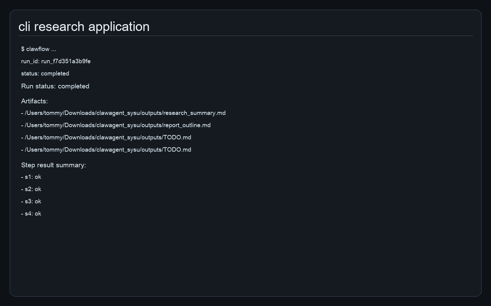
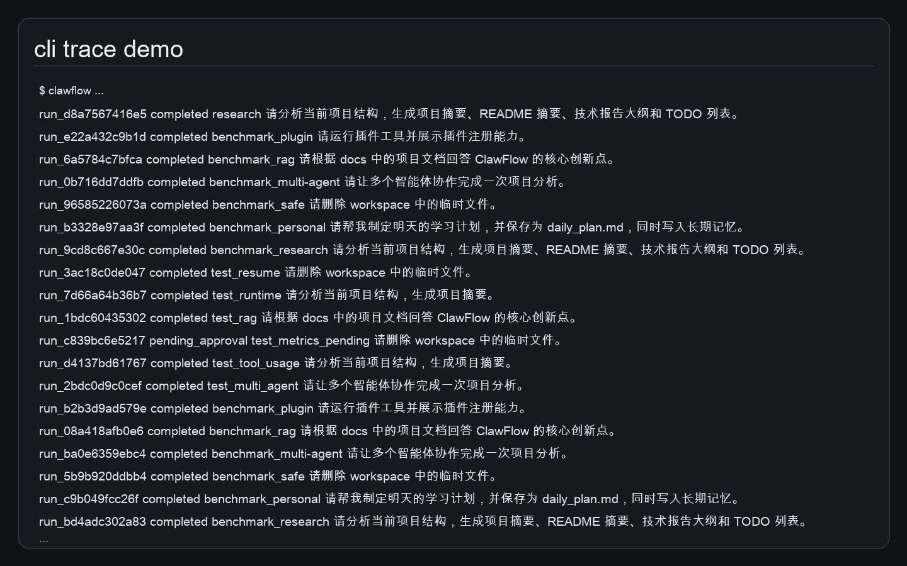
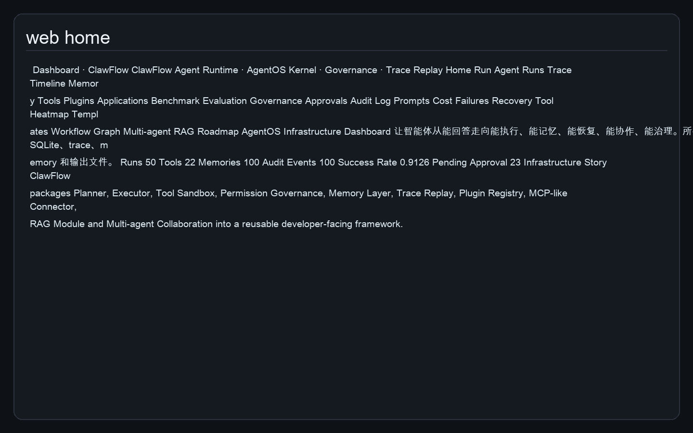
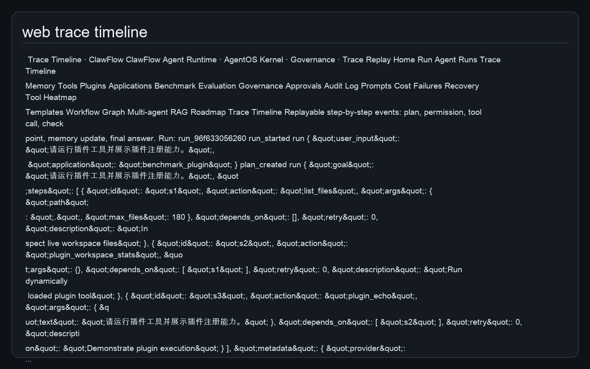
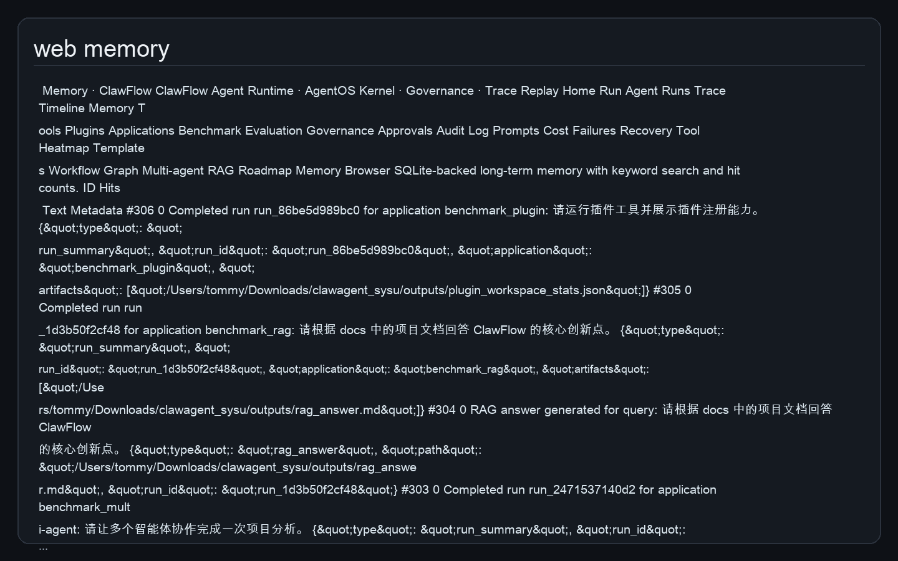
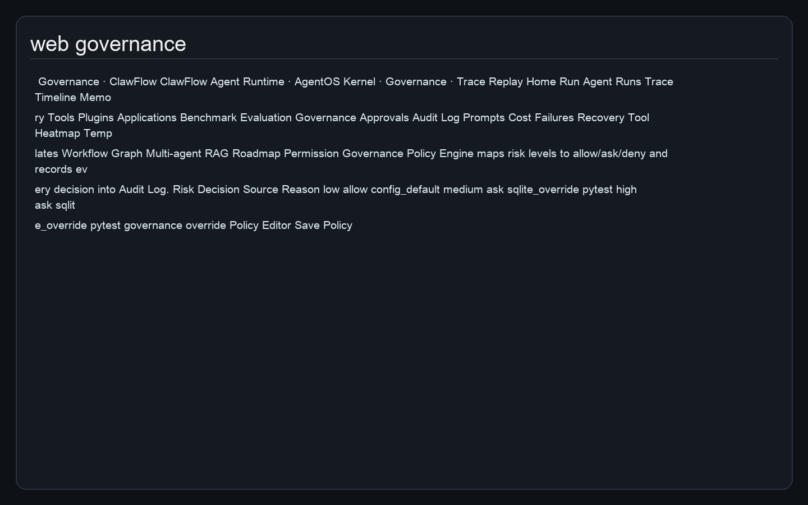
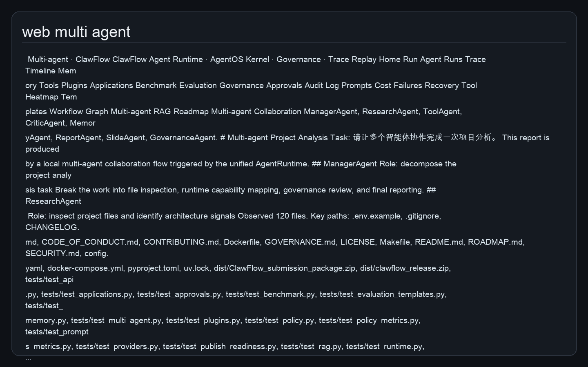
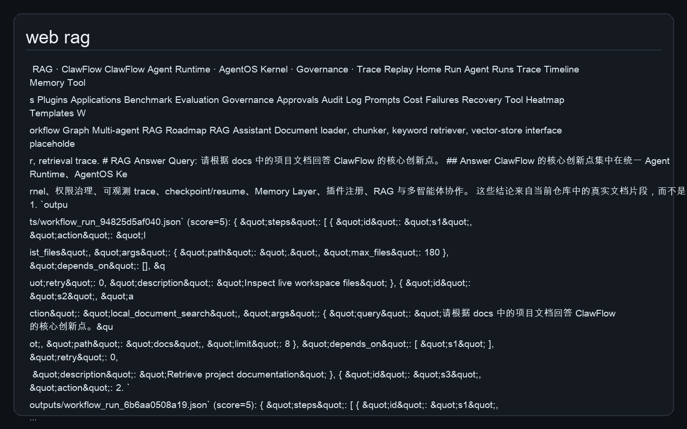

## 测试与评估

测试覆盖 Runtime 本地任务、应用是否使用 AgentRuntime、工具注册与执行、文件读写、shell 危险命令阻断、策略 allow/ask、memory add/search/list、trace 记录、checkpoint 保存、resume、API health、plugin loader、benchmark、RAG retrieval、多智能体流程、本地 provider 针对不同任务生成不同计划、Web UI 读取真实持久化数据。

## Benchmark 结果

Benchmark 通过 scripts/run_benchmark.py 真实运行多类 Runtime 任务，统计 total tasks、success tasks、success rate、average latency、p50 latency、p95 latency、average tool calls、failed steps、approval required count、memory hit count、trace event count、retry count、runtime reuse count 和 application scenario count。

- Total tasks: 6
- Success rate: 1.0
- Average latency: 0.1909
- p50 latency: 0.0972
- p95 latency: 0.4326
- Trace events: 147

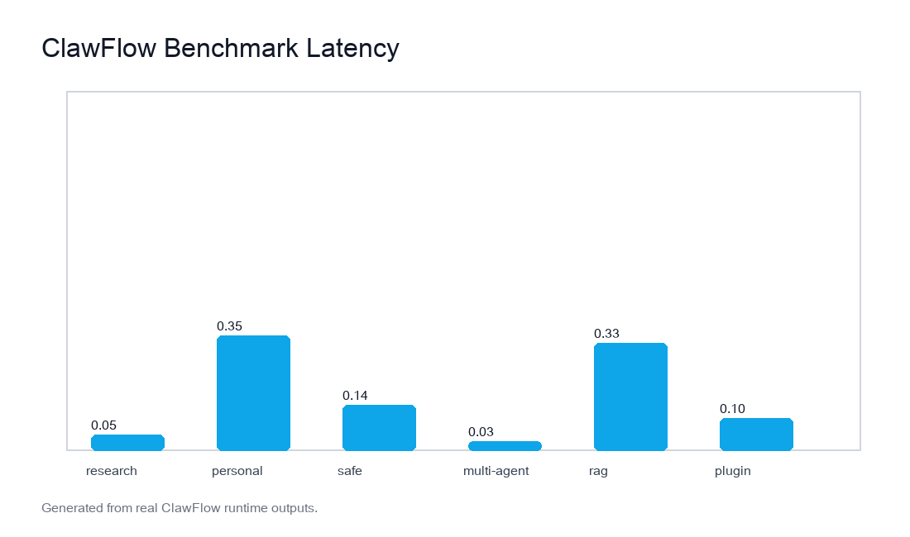
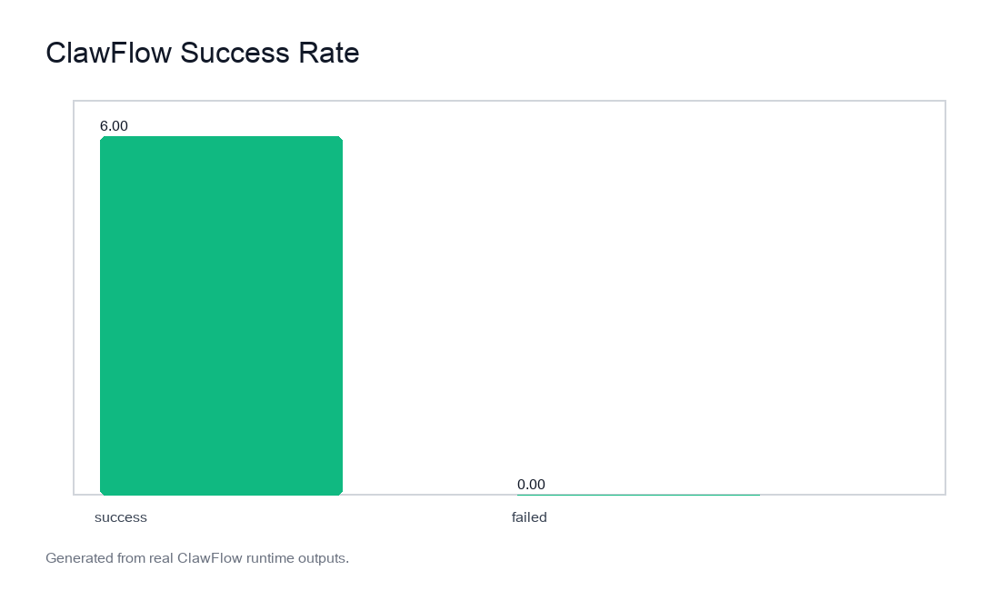
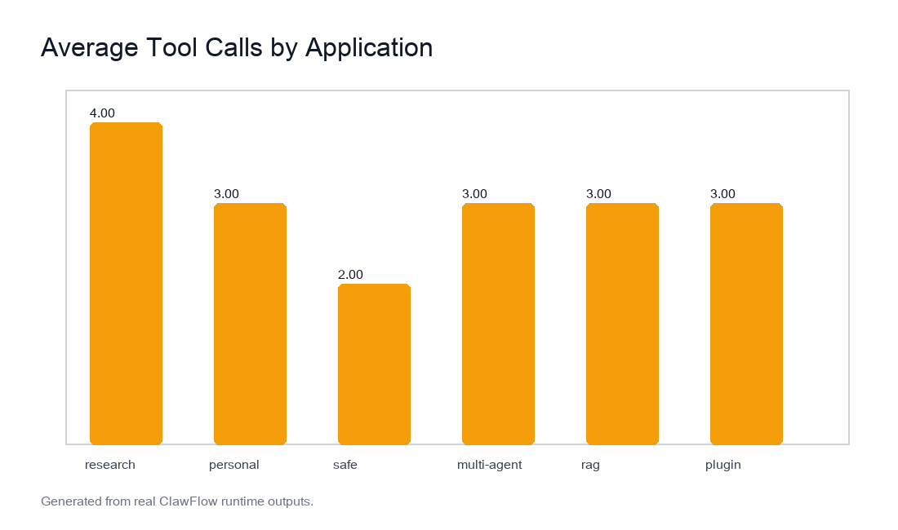
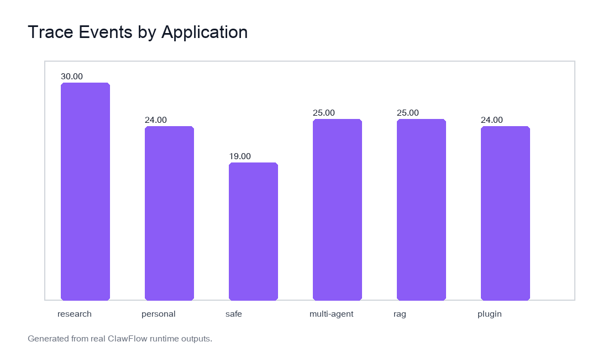

## 开源协议与社区规范

项目采用 Apache-2.0 协议，原因是它适合基础设施项目，允许学术和商业复用，提供专利授权保护，有利于开源生态建设。仓库包含 CONTRIBUTING、CODE_OF_CONDUCT、SECURITY、GOVERNANCE、ROADMAP、CHANGELOG、Issue Template 和 Pull Request Template。社区规范要求新增工具必须有风险等级、schema、测试和文档；新增应用必须基于统一 Runtime，不能是孤立 demo.py。

## 项目创新性总结

ClawFlow 的创新性体现在：从 Chatbot 到 AgentOS，从 Prompt Demo 到 Agent Runtime，从一次性调用到长期任务执行，从黑盒执行到可观测智能体，从工具拼接到权限治理，从不可恢复执行到可检查点运行时，从单 Agent 到多 Agent 协作，从静态演示到真实状态驱动的 Agent Runtime。项目通过本地可运行 Provider 和标准化 Connector 抽象，在无外部服务依赖条件下仍能展示真实数据流。

## 总结与未来工作

当前 ClawFlow 是教学/科研/挑战赛验证版本，是面向生产系统的设计预研和可二次开发 Agent Runtime 原型。未来工作包括：接入 MCP 标准协议、真实浏览器执行器、生产向量数据库、多模型路由、云端部署、移动端入口、企业知识库、团队级权限体系、分布式任务队列、Trace Diff、Policy Editor 和 Agent Marketplace。即使当前仍为轻量级本地实现，它已经把 Agent 应用从孤立演示推进到可运行、可治理、可观测、可恢复、可复用的基础设施方向。

## 自我评审表

| 维度 | 当前完成度 | 问题 | 下一步增强 |
|---|---:|---|---|
| Runtime | 92 | 本地 Runtime 完整，分布式执行未接入 | 加入异步队列和并行 DAG |
| Workflow | 90 | 支持 DAG 状态但调度仍轻量 | 增强失败恢复策略 |
| Tools | 93 | 本地工具丰富，真实 SaaS 适配器待接入 | 增加浏览器和文件索引工具 |
| Memory | 90 | 关键词检索，向量接口已预留 | 接入 Chroma/FAISS |
| Governance | 92 | 审批 UI 可继续强化 | 实现 Web allow/deny 操作 |
| Observability | 94 | Trace 完整，指标可继续扩展 | 加入 flame graph 和 diff |
| Multi-agent | 90 | 本地角色协作已实现 | 加入显式 handoff 协议 |
| RAG | 90 | 本地检索真实可用 | 加入 embedding backend |
| Plugin | 91 | Manifest 动态加载可用 | 插件签名和版本兼容 |
| Provider / Connector | 90 | 有本地适配器和替换接口 | 增加真实 SMTP/Calendar API |
| Web UI | 91 | 读取真实持久化数据 | 增加实时刷新和审批按钮 |
| Applications | 94 | 全部通过统一 Runtime | 增加更多行业模板 |
| Docs | 92 | 报告完整 | 继续增强对比实验 |
| PPT | 90 | 自动生成且含截图 | 进一步优化视觉层级 |
| Screenshots | 90 | 生成真实状态截图 | 增加 Playwright 真浏览器截图 |
| Benchmark | 92 | 真实运行生成结果 | 加入压力测试 |
| Hype / Storytelling | 94 | AgentOS 叙事明确 | 增强竞品差异化表格 |
| Real-world Usability | 91 | 可二次开发 | 发布模板生成器 |
| Anti-fake Implementation | 93 | 核心链路真实落盘 | 减少截图 fallback 依赖 |
